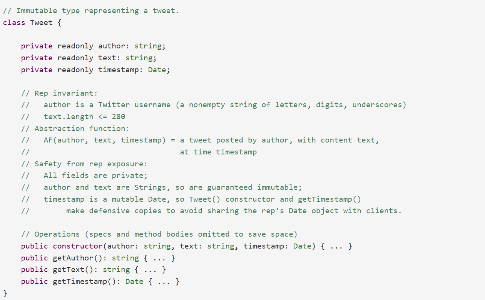
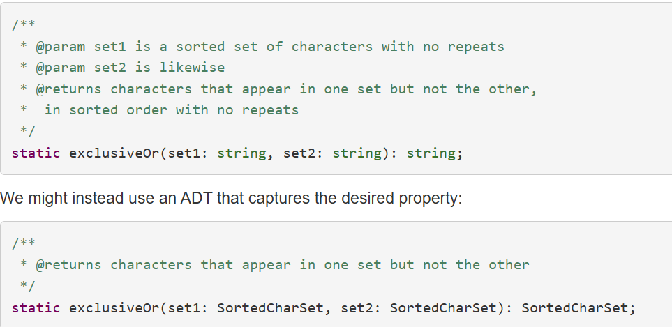
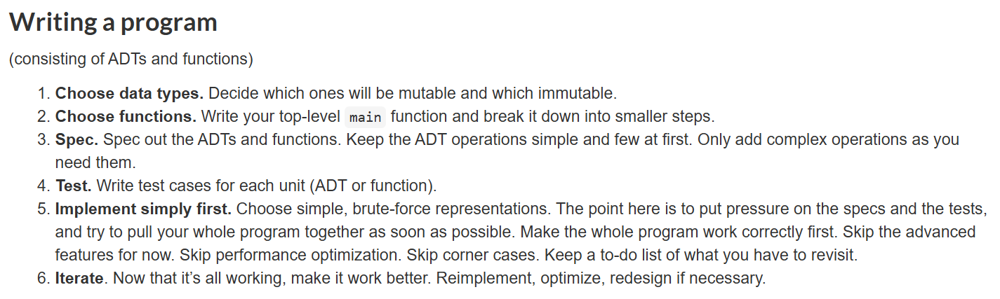
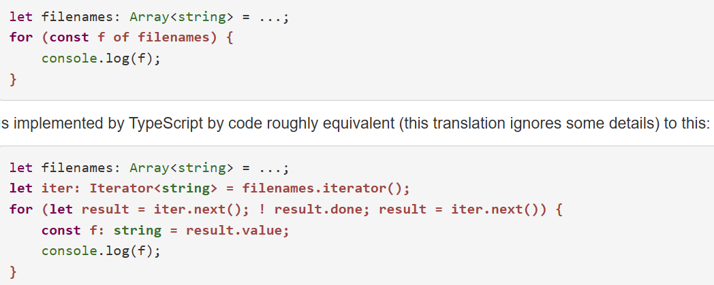
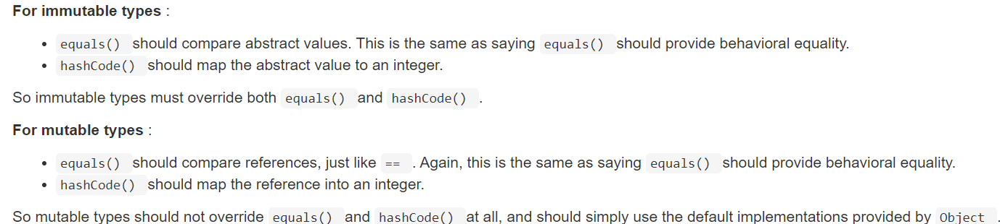
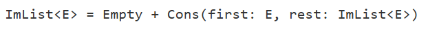
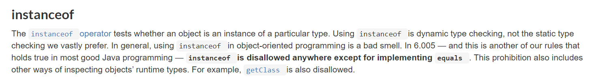
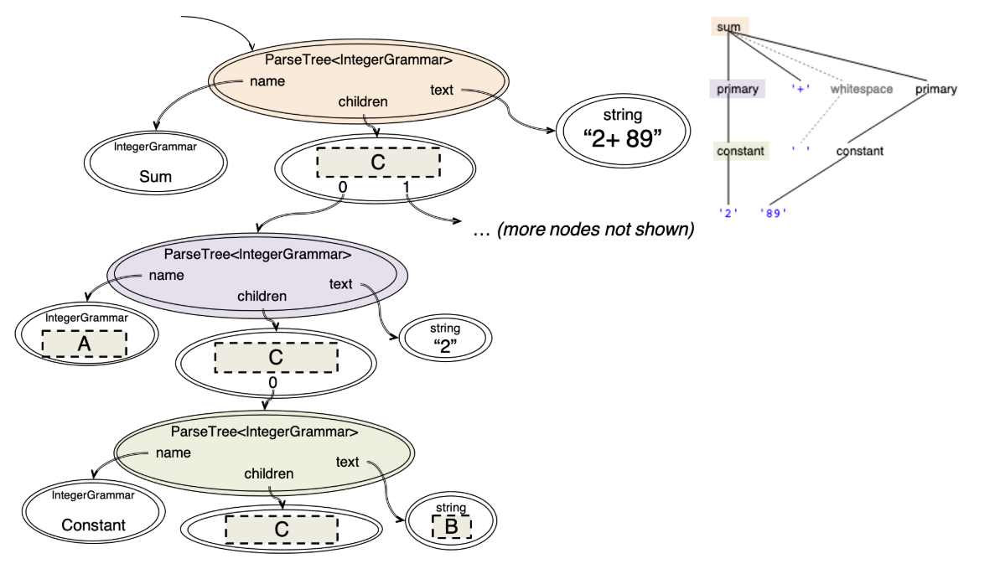

# Mit 6.102 software construction
## 7. Abstract data types
### Abstraction
- Abstraction. Omitting or hiding low-level details with a simpler, higher-level idea.
- Modularity. Dividing a system into components or modules, each of which can be designed, implemented, tested, reasoned about, and reused separately from the rest of the system.
- Encapsulation. Building a wall around a module so that the module is responsible for its own internal behavior, and bugs in other parts of the system can’t damage its integrity.
- Information hiding. Hiding details of a module’s implementation from the rest of the system, so that those details can be changed later without changing the rest of the system.
- Separation of concerns. Making a feature (or “concern”) the responsibility of a single module, rather than spreading it across multiple modules.
  
### user defined types
数据抽象的核心思想: 一个类型可以对其执行的操作来定义, 类型的使用者不再需要知道具体是如何存储的, 只需要知道能进行什么操作.

### classifying types and operations
一个ADT的operations可以被划分为:
- Creators: create new objects of the type, 动态方法或者静态方法(又叫factory), 参数为其他类型, 结果为当前类型;
- Producers: create new objects of the type, 但是参数需要有当前类型的对象
- Observers: take objects of the abstract type and return objects of a different type
- Mutators: change objects

### Representation independence
1. client只是根据ADT的公共方法的spec进行调用, 而不能看到具体细节. 因此, 修改ADT的具体实现并不影响client的调用; 注: client只能访问ADT的方法, 不能访问具体的成员(即使是public) 
2. 使用defensive copying可以避免对象被更改

## 8. Abstraction Functions & Rep Invariants(Immutable ADT)
### Avoid rep exposure
1. rep exposure: 外部代码可以直接修改表示, 而不经过ADT指定的函数;
2. 仔细检查ADT的参数和返回值类型, 对于可变对象, 使用defensive copying, 避免直接返回可变数据的直接reference;
3. 注: 仔细检查有无可变对象
4. 解决方案: 
   - 对于immutable: 使用private + readonly, 或者public + readonly
   - 对于mutale: 使用readonly + defensive copying
5. example:
   - all fields are private
   - author is String, so are guaranteed immutable
   - date is a mutable Date, so some functions make defensive copies to avoid sharing the rep's Date object with clients

### Rep invariant and abstract function
1. 设计ADT时的考虑要素: 
   - abstract space: 要表示的对象的值空间
   - rep space: 使用的表示方法的空间
   - rep invariant: 决定哪些representation是合法的, 是对于rep space中值的要求
   - abstract function: 将符合rep invariant的对象映射到abstract space中的对象的函数

### Checking rep invariant
1. 在ADT的impl中时刻保持rep invariant, 与loop invariant意义相同;
2. 使用checkRep函数在每次函数即将返回时对rep invariant进行检查;

### No null values in the rep
1. 在设计ADT时避免使用null或者undefined
2. 除非显式说明, 否则默认不能等于null或者undefined, 在有strict null-checking情况下, checkRep中也不需要写null检查;

### Benevolent side-effects
1. ADT的immutable指的是其表示的在abstract space中的值不变, 而其内部rep可以改变, 这种rep的改变是被允许的并且有时是有益的;

### Documenting the RI and AF
1. 需要写好RI, AF, rep exposure safety argument
2. 好的AF需要能够使得表示空间的值到抽象空间的值是单设的;
3. 示例: 

### ADT invariants replace proconditions
1. 使用专门设计的ADT代替函数的前置条件

### Write an abstract data type
1. Spec: 为这个data type的opertaion写spec(一个data type由其operations决定), 此时不涉及AF以及Rep;
2. Test
3. Implement: 
   - 写清楚该类的private fields(即内部表示), 为rep写注释说明, 包括rep invariant, abstract function以及rep exposure argument; 
   - Assert rep invariant: 写一个checkRep函数, 该函数中使用assert语句即可, 不需要返回true/false
   - Implement operations: 为每一个operation写impl, 注意要在每一个operation中都调用checkRep

### Writing a program


## 9. Defining ADTs with Interfaces, Generics, Enums, and Functions
### Interface
1. Interface可以仅仅specify the contract for the client, 而不需要具体的实现(rep free)
2. Interface下可以有很多种对于该Interface的表示方法, 满足不同情况下的性能需求

### Subclassing

### Generic types

### Enumeration

## 10. Functional programming
> modeling problems and implementing systems with immutable data types and operations that implement pure functions

### First-class functions
1. 在tyoescript中, 函数是first-class的, 意味着函数可以像变量一样被传递;

### Iterator
1. Iterator是一种设计模式, 可以为client提供统一的处理序列的方式, 否则在使用list/set等方式处理序列时需要修改部分代码, 不够完善;
2. Iterator是可变的, 因此尽量不要在循环进行时修改Iterator的内置数据, 例如array

### map/filter/reduction
1. 使用map, filter and reduction处理Iterable type, 可以跳过复杂的循环过程、中间变量、以及避免直接修改可变对象; 另外, 由于返回值为同类型, 故可以进行链式操作;
2. 可以使用map, filter, reduction进行类似于python中的列表推导式的操作;
   
## 11. Equality
### Equivalence relation
1. 即离散数学中的等价关系, 满足: 自反性、对称性、传递性三个主要性质;

### Equality of immutable types
1. Using the abstract function: 如果两个不可变对象A, B映射到abstract space后值相等, 
   则说明这两个对象相等, 即$AF(A) == AF(B)$;
2. Using observation: 如果两个对象的任何Operation的值相等, 则说明两个对象相等;
3. AF和observation需要保持一致;

### Reference equality vs Value equality
1. reference equality: 判断两个变量是否指向内存中的同一块空间;
2. value equality: 判断两个变量是否值相等;
3. 在自定义ADT时需要自定义eqaulValue函数, 用于判断两个ADT objects是否相等, 需要满足等价关系的三个性质;

### Equality of mutable types
相对于immutable types, mutable types需要对相等性进行进一步划分, 分为observational equality以及behavioral equality:
1. observational equality: 两个对象调用不改变其自身状态的方法(observer以及producer)的情况下相等, 相当于调用equalValue()方法;
2. behavioral equality: 两个对象始终相等, 即使一个对象调用了改变其自身状态的方法, 相当于调用typescript中的'==='对引用进行检查;
   
### "Deep equality" on collections
typescript自身没有实现对于built-in collections的observation equality检查;

### Hash functions
1. 设计原则: 
   - 等价性: 与equals()一致, 即两个相等对象的hashcode必须相等
   - 均匀分布: 多使用质数, 减少不同对象哈希码冲突的概率
   - 不可变性: 因为我们只需要对不可变对象定义hashcode函数, 故hashcode值在该不可变对象的声明周期中也需要保持不变, 因此当hashcode计算复杂度较高时, 可以采取先计算一次然后缓存(即存入一个变量中)的方式降低时间复杂度.

### Equals and HashCode function Design



## 12. Recursive data types
### Recursive data type definitions
1. 构造递归的数据类型也需要base case类型和用于递归的类型
2. 多种数据类型实现一个递归的数据类型: 
### Rep independence and rep exposure revisited

### Null vs. empty
使用哨兵对象来表示空, 而不是使用null或者undefined, 使用哨兵对象可以保证操作在ADT大小上的连续性(即不会因为ADT为空而导致操作不连续)

### Dynamic type inspection
1. 避免使用instanceof()这样进行动态类型检查, 否则导致代码可读性、扩展性差, 除了equals()以外都需要额外在类以及子类上定义helper functions来避免;
2. 应该尽量使用这个ADT必然会有的方法, 而不是使用动态类型检查;

### Backtracking search with immutability
1. 对于上述的Imlist, 可以看到其rest部分是可以被共享的, 而其first部分无法共享, 这样的性质很好, 因为可以记录所有previous部分, 而不必每次都创建一个对象, 这样会消耗大量内存;
2. Imlist特别适合进行回溯, 因为其previous部分是共享的;

### Immutability and performance

## 13. Grammars and Parsing
### Grammars
1. 语法: 用于描述一系列符号构成的字符串, 通过语法, 我们可以判断哪一些字符串是合法的;
2. 语法的基本元素
   - 终结符: 不可进一步扩展的元素, 用引号表示, 例如: 'http'
   - 非终结符: 可以进一步扩展的元素, 即可以由其他的终结符或者非终结符进行定义
3. 产生式: 语法由一系列产生式或称规则构成, 每一条产生式的格式如下: 
   - nonterminal ::= expression of terminals, nonterminals, and operators 
4. 根非终结符: 整个语法所描述的核心, 解析字符串时, 通常从根非终结符开始

### Parse trees
> Matching a grammar against a string can generate a parse tree that shows how parts of the string correspond to parts of the grammar.

1. 解析树中的内部节点都为非终结节点, 叶节点都为终结节点, 按顺序(前序遍历)连接叶节点得到代表的字符串.
2. ParseLib中的parse tree: 

### Regular expression

### Constructing an abstract syntax tree
将parse tree转为抽象语法树

### Parser generators
1. 解析器的核心流程
   - 解析: 读取输入的字符串, 并尝试按照文法规则匹配字符串序列
   - 构建解析树: 解析器将符合文法的部分组织成层次结构的解析树
   - 生成抽象语法树: 将解析树转为递归数据结构

## Project2 notes
### Interface
1. Interface可以在仅提供一组接口的情况下内置多个实现;
2. 实现Interface的类的在interface中出现的函数可以不用再写spec, 因为spec是不依赖于具体实现的;
3. Test for interface: 写完接口spec后, 即开始写test, test写static和instance两种测试, 这两种测试仅仅针对interface, 不针对interface的具体实现; 注: test for interface需要使用子test来进行继承, 子test中会测试实现interface的类;

### Design ADT
1. 任何东西都可以被作为ADT;
2. 写明ADT的spec, 弄清楚abstract function, rep invariant 以及避免 rep exposure;

### Implement ADT
1. 写好checkRep(): checkRep中使用assert语法即可, 一旦有错立刻终止(fail fast); 
2. 注意在每一个函数中都需要使用checkRep进行检查, rep invaraint 和 fail fast的思想;

### 函数设计
1. spec设计, 函数返回值设计, 函数参数设计:
   ```Java
   /**
     * Add, change, or remove a weighted directed edge in this graph.
     * If weight is nonzero, add an edge or update the weight of that edge;
     * vertices with the given labels are added to the graph if they do not
     * already exist.
     * If weight is zero, remove the edge if it exists (the graph is not
     * otherwise modified).
     * 
     * @param source label of the source vertex
     * @param target label of the target vertex
     * @param weight nonnegative weight of the edge
     * @return the previous weight of the edge, or zero if there was no such
     *         edge
     */
    public int set(L source, L target, int weight);
   ```