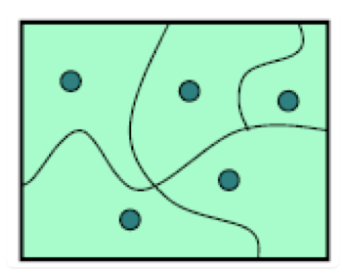
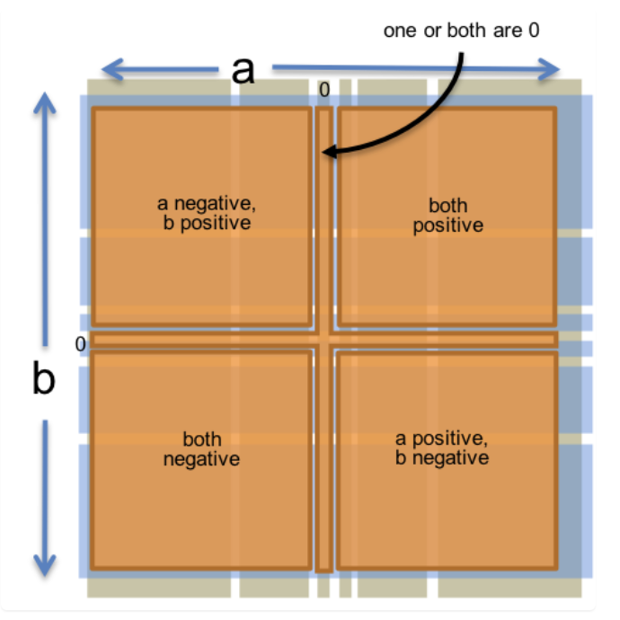
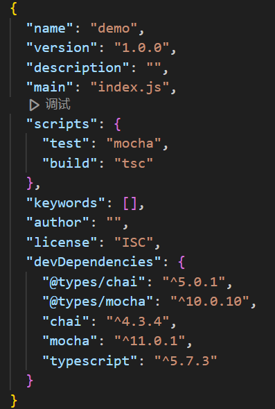
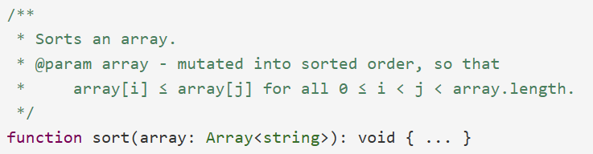
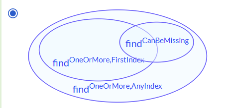
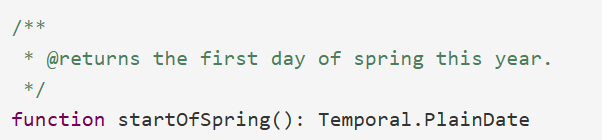
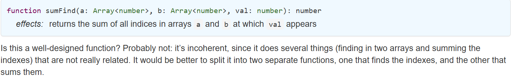

# Mit 6.102 software construction -- Spec and Test
## 1. Typescript start
### Snapshot diagrams
1. Snapshot diagrams 表现了程序运行时内部变量的状态
2. 依据想要表现的对象有所侧重
3. 当想要强调不可变对象时, 使用画双线
4. 注: 内存管理模型同C++

### Typescript Grammars
1. 可变对象与不可变对象
2. arrays, maps, sets
   - 变量声明
   - 迭代
   - 数组等缺失值问题
3. 变量声明: let
4. 对象声明: 对象: {}, 数组: []
5. enum枚举: 限定小范围可数的一些变量

### Ideas
1. typescript使用for循环, 尽量避免多加索引

## 2. 静态检查

### Background Knowledge
1. 静态类型检查: 是***Static checking(在编译时检查错误)***的一种方式, 静态类型检查是一种减少错误的方式, 即检查进行的运算有没有作用在错误的变量类型上;
2. Belief: 静态类型的使用对构建一个大型的软件系统尤为重要;
3. Typescript在进行静态类型检查之后会将静态类型信息丢弃;
4. 渐进类型: 由动态类型过度到静态类型(Typescript是向动态的Javascript中添加了静态元素);
   
### Static checking, dynamic checking, no checking
1. 一个语言可以提供如下的三种检查: static checking, dynamic checking, no checking, 静态检查 > 动态检查 > 不检查;
2. Typescript中为: 使用静态检查 + 不检查的方式, 因为typescript的动态检查依赖于javascript, 但是javascript不进行动态检查, 而是采取不检查的方式: y / 0 = infinity, 而不会在运行时报错(即说明没有动态检查);
   
### Typescript中的数字表示
Typescript中的数字表示存在一些corner cases
1. 极限精度问题: 超出了$SAFE_INTEGER$的精度就无法保证数字可以被精确的表示, 因为typescript中都是采取浮点数的方式表示数字, 并且浮点数没办法精确地表示;
   ```Typescript
   let x: number = 0;
    x += 0.1; x += 0.1;
    x += 0.1; x += 0.1;
    x += 0.1; x += 0.1;
    x += 0.1; x += 0.1;
    x += 0.1; x += 0.1;
    // x should be 1.0
    console.log(x);
    console.log('is x === 1.0?', x === 1.0);

    >>> false
   ```
2. 极值问题: Number.NaN, Number.POSITIVE_INFINITY, Number.NEGATIVE_INFINITY;
3. 大小问题: 超出了number类所能表示的极限范围就会产生溢出问题;
4. Number是number的类包装器, 但在声明时应该仅使用number, 仅当要访问特殊数字时再使用Number;

### Function
1. 注释: 补全函数签名中没有涉及到的内容, 涉及到的内容不用写, 比如参数类型、返回值类型等
   - 函数功能
   - 输入
   - 输出
  
### mutating values and resassigning variables
> Immutability – intentionally forbidding certain things from changing at runtime – will be a major design principle in this course.
1. 不可变性分为两种情况: 值是否可变, 变量是否可以被重新赋值
2. 在写程序时, 尽量写多的不变变量, 减少代码中的变化

### Documenting assumptions
1. 在定义声明类型时, 例如const num: number = 10时, 实际上就已经记录了关于num的假设: 不变, 数字. 并且typescript会自动帮我们检查;
2. 如果一个数字需要始终大于0, 我们也需要记录(尽管typescript不会帮我们检查);
3. ***一个程序能够正常运行, 总会有很多假设, 我们需要记录这些假设!***
4. 程序有两个目标: 与电脑交流(保证程序的正确性), 与其他人交流(保证程序简洁易懂) 

### Goal of 6.102
1. safe from bugs: 正确性(当下可以正确运行)和防御性(以后可以正确运行)
2. easy to understand
3. ready for change: make it esay to make changes

### static checking => goal of course
1. SFB: 静态检查可以在程序运行前检查类型的错误问题
2. ETU: 显式地写出来每一个变量的类型, 相当于部分地documenting assumptions
3. RFC: 静态检查识别其他需要修改的地方

## 3. Testing
### Validation
Testing只是validation的一部分, validation是证明程序正确的方式
1. formal reasoning: 对程序正确性进行形式化地证明(例如使用循环不变式)
2. code review: 其他人阅读代码并检查
3. testing: 在精心选择的输入上运行程序, 并检查结果

### Why software testing is hard
程序中的错误往往不是连续的, 而是因为违反了某些边界条件导致突然崩溃, 这与工业中的情况不同.
因此需要系统性地设计测试用例, 而不是仅仅进行随机的检查

### Test-first programming
1. module: 模块, 程序中独立的一部分, 可以被单独地进行设计、实现、测试以及推理. module可以使函数或者类等. 模块包含implementation以及clients;
2. specification: 规范
   - inputs: 给出输入参数的类型以及参数的额外信息, 如参数必须大于0等
   - return: 返回值的类型, 返回值与输入的关系
   - typescript中, 规范 = 函数签名 + 注释
3. test-first programming:
   - 首先写好函数的签名
   - 为函数编写测试用例
   - 实现该函数
4. 注: 不要在最后才进行测试!

### Systematic testing
测试样例设计的理念:
1. 正确性: 对于任何正确的实现, 总能够通过所有测试样例
2. 完整性: 能够尽可能找出所有bugs
3. small: 方便起见, 测试样例应较少
注: 测试时应该尽可能找出问题, 而不是随意构造测试样例让代码通过

### Choosing test cases by partitioning
1. 对程序的***合法输入***进行划分, 划分的依据是输入的性质和程序的表现, 表现相同的在一个分区. 所有分区拼起来必须覆盖所有的输入空间.
2. 划分必须满足以下三个属性:
   - disjoint: 划分之间不能有重叠
   - complete: 划分之和覆盖整个输入空间
   - nonempty: 不存在某一个子区域是空的
3. 在分割中考虑边界情况
   - 边界情况很有可能导致认为失误, 特殊情况, 程序不连续等, 因此需要着重检查   
   - 以下是针对两数乘法考虑边界情况的划分
4. 考虑多种分割情况
   - 由于对于每一个参数找出划分再笛卡尔积所产生的测试用例过多, 不可能完成, 因此考虑多种划分, 这样通过选择较少的测试情况覆盖所有情况
   - 以下是针对两数乘法考虑边界情况的划分
5. 总结: 
   - 依据输入的划分构造测试用例
   - 输入划分的规则
   - 可以根据输入的边界条件进行划分
   - 可以根据输出的情况对输入进行划分
   - 当不同变量划分的笛卡尔积很多时, 使用多种划分规则, 精心设计找出能够涵盖所有子域的情况(这些情况的数量比笛卡尔积少)

### Automated unit testing
基于mocha的自动化单元测试, 以下过程是创建一个ts项目(含mocha)的过程:
1. 创建项目目录: mkdir mocha-ts-demo && cd mocha-ts-demo
2. 将目录变为npm项目: npm init -y
3. 初始化tsc: tsc --init
4. 在当前项目中安装mocha: 
   - 安装mocha并提供类型支持: npm install mocha @types/mocha --save-dev
   - 安装chai并提供类型支持: npm install chai @types/chai --save-dev
   - 安装sinon并提供类型支持: npm install sinon @types/sinon --save-dev
5. 修改package.json文件
   

### Documenting your testing strategy
为测试策略写注释

### 黑盒测试与白盒测试
黑盒测试: 无法看到具体实现, 只能根据specifacation设计测试用例
白盒测试: 可以看到具体实现, 可以根据具体实现设计测试用例

### 测试的覆盖率
1. 语句覆盖率: 测试能够覆盖语句的数量
2. 分支覆盖率: 分支的覆盖情况(极难100%)
3. 路径覆盖率: 程序所有逻辑路径的覆盖率(极难100%)

### unit test and integration test
1. unit test: 测试一个模块的正确性
2. integration test: 测试多个模块之间的正确性
   - 当一个模块中有调用其他模块时, 可以使用存根方法将这个模块隔离开
   - 存根: 实现了函数或者方法的接口, 但不执行实际功能, 而是返回预定义的输出
   - 模拟对象: 当存根用于替代一个类时, 也称模拟对象

### Automated regression testing
1. 每次修改后保证已有的测试样例通过
2. 每次发现bug, 都将该输入作为一个测试样例加入, 这样可以避免程序回退
3. automated testing + regression testing = automated regression testing

### Iterative test-first programming
1. 本节所讲的test-first programming是一个迭代的过程, specification->test->implementation每一步无需一次做到完美, 而是在进行下一步时发现上一步的问题并修改, 反复迭代最终完善程序
   
### Summary
本节所讲的testing思想与course goal的关系
1. safe from bugs: 测试可以帮助我们减少bugs
2. easy to understand: documenting测试可以帮助别人理解test strategy与partition strategy
3. ready for change: 正确的测试值依赖于spec, ***而不依赖与具体实现***. 同时, 回归测试可以帮助我们在修改代码的时候不至于回退.


## 4. Code review
### Don't repeat yourself
重复代码可能会导致遗漏更改等问题

### Comment where needed
1. specification
2. implementation中的注释: 以代码分段的方式标注, 另外标注一些不明显的地方

### Fail fast
1. 代码要能够以最快的速度反应外部输入的错误: 静态 > 动态 > 无
2. implementation中加入错误处理, 而不是返回一个错误的值
   
### Magic numbers
避免出现魔法数字, 使用const常量更好

### One purpose for each variable
每一个变量只负责一个功能, 不要重用变量

### Use good names
变量名应该能做到替代对变量本身进行的注释

### Use whitespace and punctuation to help the reader

### Functions should return results
函数需要返回值, 而不是把结果进行输出(最顶层与人类直接交互的层面可以输出到屏幕).
Typescript中, 如果一个函数需要返回多个值, 则使用{}结构的方式返回 

### Avoid special-case code   
尽量不要写特殊情况的处理, 让代码变得通用, 因为特殊处理可能会带来上下处理不一致等问题;
即使特殊处理能够加速代码, 也先实现一个简洁通用的版本, 然后再考虑优化

## 5. Specifications
### Behavioral equivalence
1. 为了能够验证两个module是否是表现等效的, 那么需要写清楚该module的requires和effects, 
   
### Specification structures
1. function signature
2. requires: additional restrictions on the parameters, 对应为前置条件
3. effects: describing the return value, exceptions, and other effects of the function, 对应为后置条件

### Specifications in Typescript 
1. 将前述的requires(前置条件)与effects(后置条件)映射至实际Typescript注释如下:
```Typescript
/**
 * Find a value in an array.
 * @param arr array to search, requires that val occurs exactly once
 *            in arr
 * @param val value to search for
 * @returns index i such that arr[i] = val
 */
function find(arr: Array<number>, val: number): number
```
2. 注释规范
   - 参数不再重写类型(function signature中已有), 而是应该简述参数的意义
   - requires 和 effects 融入到@param和@returns中

### Avoid null
1. null是一个模糊且容易出错的概念, 并且***不等于"", [], {}等空值***, 在代码中应该避免使用null, 一般约定函数的参数以及返回值不能为null
2. 空值是可以被大量使用的
   
### Testing and specification
1. 可以根据具体的implementation设计新的test suit, 但是仍然严格认为程序的行为符合spec, 而不是具体的implementation
2. 构造的测试样例需要严格遵守规范, 并且不用测试invalid输入

### Specifications for mutating functions
除非在spec中明确说明, 否则认为这个函数不会改变可变值;
mutating function的spec如下, 将变化写在@param中: 

### Exceptions
0. 注: Typescript中由于没有静态检查异常的机制, 因此不常用exceptions, 用undefined居多, 参考内置的array\map等设计
1. 当用户输入不符合spec时, 程序应该能够抛出异常, 但是这个异常不应该在spec中提到;
2. 当用户输入符合spec时, 程序也可能抛出异常, 这时该异常应该要在spec中以@throw的方式说明;

### special results
1. 由于Typescript缺少对于exception捕获的静态检查(即可能没能捕获由其他函数抛出的异常), 因此容易导致程序崩溃; 因此, 可以采用返回特殊值的办法来避免程序崩溃, 同时undefined也支持静态检查;
2. Typescript中使用undefined情况较多, 例如array中索引超限会返回undefined, 而不是像py一样抛出exception
   ```Typescript
   const zoo = [ 'Tim' ];
   for (let i = 0; i <= 1; i++) {
      let name: string = zoo[i];    // zoo1: undefined
      console.log(`Hello, ${name}!`);
   }
   ```

## 6. Design specs
### Properties of specs
1. deterministic vs underdeterministic: 
   - 当module的输入满足spec的要求时, 如果根据spec得到的结果唯一, 则是deterministic的
   - 否则为underdeterministic
2. declarative vs operational: 
   - 如果spec中只给出了返回值的性质以及与输入的关系, 并没有给出计算步骤(不暴露代码), 则为declarative的;
   - 如果给出了较为详细的计算步骤(伪代码), 则为operational的(错误的写法, 不这么写);
   - 注: ***使用声明式spec***, 不要使用operationa, 因为这样会不仅使得spec不够简洁, 同时泄露了代码的具体实现, 另外有可能使阅读者产生误解
3. stronger vs weaker: 该spec是否可以有多种的代码实现方式(注: 不等于暴露代码)
   - stronger: 该spec对输入的要求较低, 对输出的要求较高, 即该spec有较强的适应性
   - weaker:  该spec对输入的要求较高, 对输出的要求较低, 即该spec适应性较弱
   - 满足stronger spec的实现必然可以满足weaker spec

### Spec强度比较 -- 文氏图形式
如果S1强度高于S2(S1更普适的输入, 更精确的输出 => impl满足S1则必然满足S2), 则满足S2的impl必然可以被满足S1的impl替代 

### Risks of mutation
1. 输入mutable: 函数有可能在实现中更改输入, 除非特殊说明, 否则函数中的参数是不会被改变的
2. 输出mutable: 用户可能会后续更改输出, 可能会影响到原函数的功能. 此时如果引入防御性复制, 则又会增加大量内存消耗, 影响程序性能; 如果某一个函数返回了一个可变对象, 会使得实现者与client之间的contract复杂化, 因此尽量返回不可变的对象(例如自己实现一种功能相同的不可变对象) 
   

### Designing good specifications
1.  coherent: 函数的目标要前后一致, 函数应该仅仅实现一个功能, 而不是将两个不相关的功能拼在一起 
2.  carefully consider mutation: 尽量是immutable的
3.  strong enough: spec需要足够强以至于可以被用户使用, effects需要被用户能够准确地了解
4.  weak enough: 
     > the specification should say something much weaker: that it attempts to open a file, and if it succeeds, the file has certain properties.

